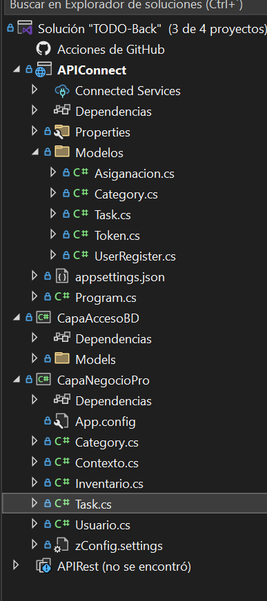

# Project TO-DO

# Project: TO-DO

This project is a simple web app to manage your tasks and objectives, helping you remember and check them in the future.

## Status

The app is currently in the development stage. As a result:

- The program has a API REST functional
- Documentation needs to be compiled in a more structured way.

## Description

The program is designed to be organized into different components:

### Database

We chose PostgreSQL because it is easier to find compatible cloud services. Additionally, pgAdmin makes it simple and fast to manage the database.

### Data Access

We are using the ORM Entity Framework, as it provides better security and simplifies working directly with the data.

### Business Layer

The app is being developed using .NET 8.

### API 
We use asp.net core to deploy our service

## Future Plans

In the future, we plan to:

- Documentate the routes
- Deploy a Cloud Data Base 
- Develop the frontend.

## Version

The current version of the program is **Hyperion 0.1.0 (pre-released)**.

## Image Structure

